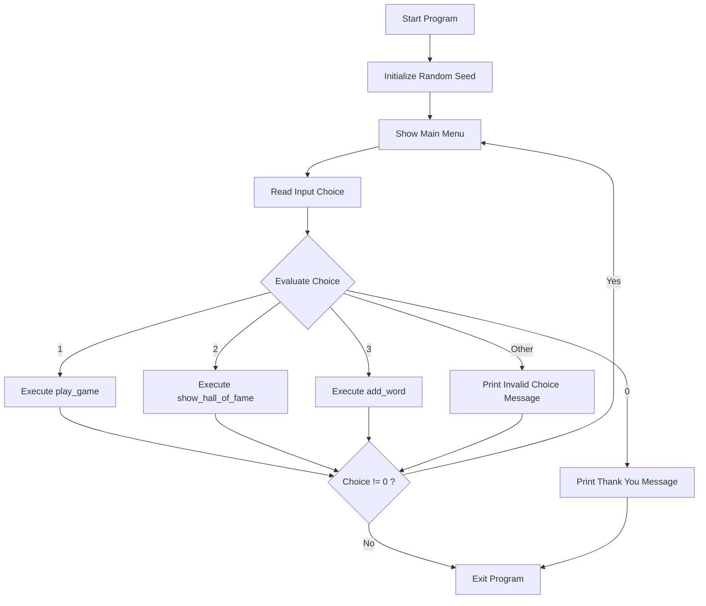
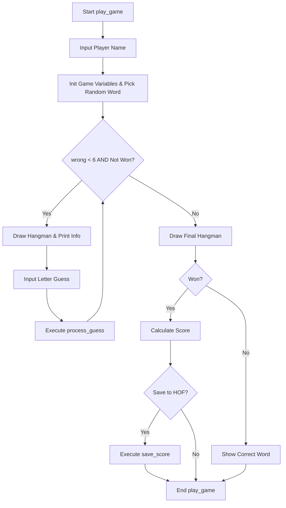
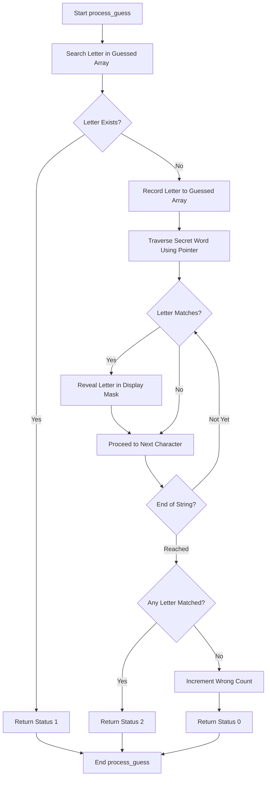
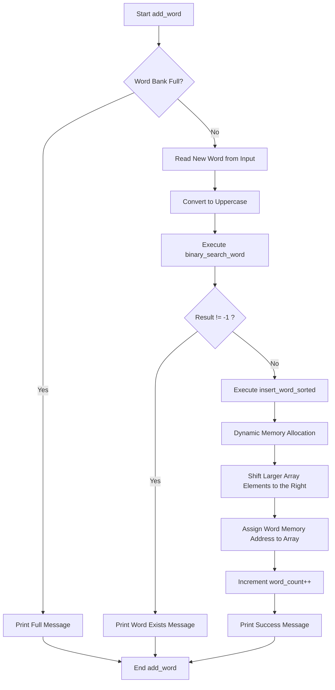
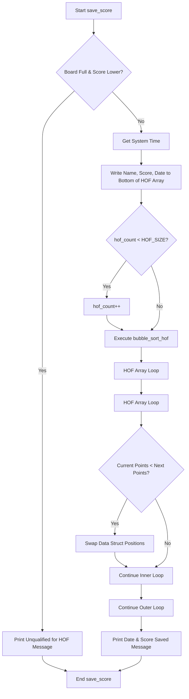

# 🤖 Word Guessing - Robotics Edition


**Final Project for Basic Programming Practicum**

An interactive Command Line Interface <CLI> application for a Hangman game themed around Robotics and Artificial Intelligence terminology. This project is built applying _Software Engineering_ principles, including memory management, _pointer arithmetic_, _binary search_, and _insertion sort_.

---

## 🛠️ Compilation and Execution

This program is written in pure C and can be compiled using `gcc`.

**1. Compiling the Program**
Open your terminal and run the following command:

```bash
gcc -Wall -o word_guess word_guess.c
```

_Note: The `-Wall` flag is used to ensure no warnings occur during compilation._

**2. Running the Program**

- **Linux / macOS:**
  ```bash
  ./word_guess
  ```
- **Windows:**
  ```cmd
  word_guess.exe
  ```

---

## ✨ Features List

1.  **Play New Game:** The classic word-guessing game. The player guesses letter by letter of a randomly selected secret word.
2.  **Dynamic Scoring System:** Score calculation takes into account remaining lives and the length of the secret word <Formula: Remaining Lives x 100 + Word Length x 20>.
3.  **Hall of Fame:** Saves the top 10 players using a _Bubble Sort_ algorithm in descending order. Integrated with `<time.h>` for automatic date recording.
4.  **Add Word to Bank:** Players can expand the vocabulary bank. The program automatically checks for duplicates using a _Binary Search_ algorithm O<log n>, then inserts the new word alphabetically using _Insertion Sort_.
5.  **Robust Input Handling:** Implements an _input buffer clearing_ system to prevent _infinite loops_ when users enter space characters or excessive input.

---

## ⚠️ Known Limitations

- **Volatile Storage:** Data for new words and the Hall of Fame is only stored in memory <RAM> while the program is running. Data will reset if the program is closed, as it does not yet utilize _File I/O_ operations.
- **Fixed Capacity:** The word bank is limited to a maximum of 50 entries `MAX_WORDS`, and the Hall of Fame is limited to 10 entries `HOF_SIZE`.
- **Alphabet Characters Only:** The game currently does not specifically handle number or symbol inputs within the secret word, although inputs are automatically converted to uppercase.

---

## 📊 Main System Flowcharts

Below is the logical flow of the program depicted using Mermaid diagrams. As per standard practice, angle brackets are used for explanatory parameters.

### A. Main Menu Flow



### B. Overall Game Session Flow <play_game>



### C. Single Guess Process <process_guess>



### D. Word Addition Process <add_word & insert_word_sorted>



### E. Score Saving and Sorting Flow <save_score & bubble_sort_hof>



---

_This documentation is compiled to meet the submission standards for the Basic Programming Practicum Final Project._
