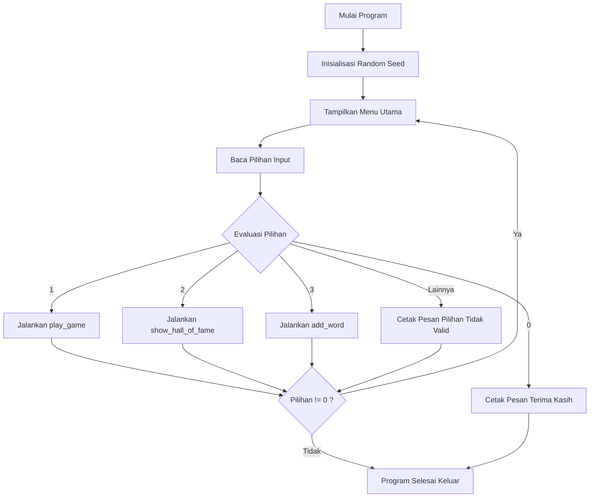
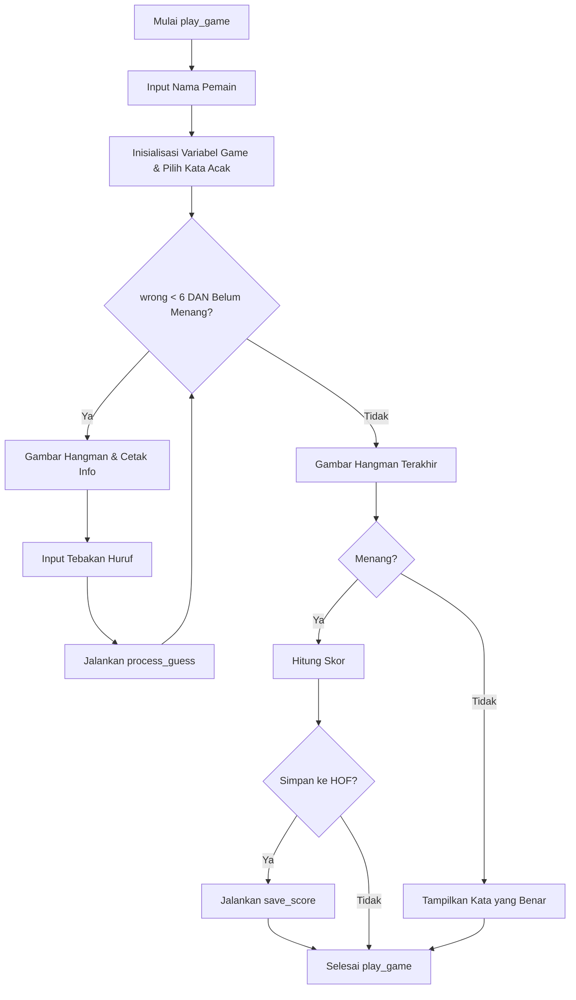
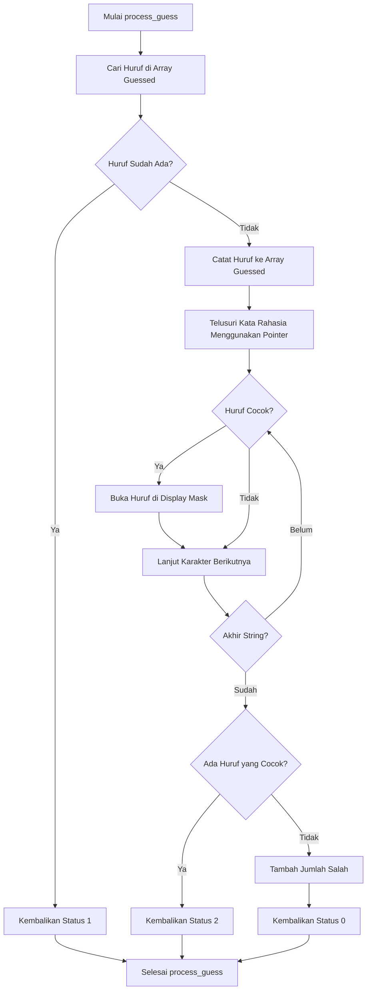
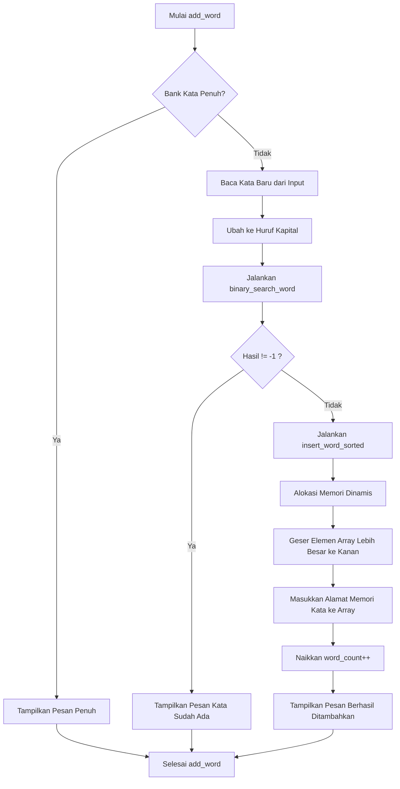
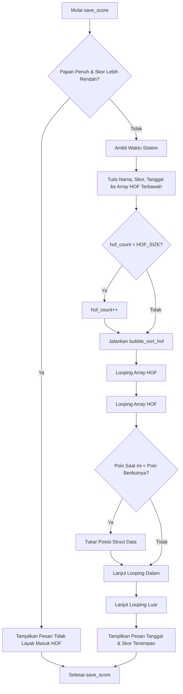

# 🤖 Tebak Kata - Robotika Edition


**Proyek Akhir Praktikum Dasar Pemrograman**

Aplikasi Command Line Interface <CLI> interaktif untuk permainan Hangman dengan tema terminologi Robotika dan Kecerdasan Buatan. Proyek ini dibangun dengan menerapkan prinsip _Software Engineering_ yang mencakup manajemen memori, _pointer arithmetic_, _binary search_, dan _insertion sort_.

---

## 🛠️ Cara Kompilasi dan Menjalankan

Program ini ditulis dalam bahasa C murni dan dapat dikompilasi menggunakan `gcc`.

**1. Kompilasi Program**
Buka terminal dan jalankan perintah berikut:

```bash
gcc -Wall -o tebak_kata tebak_kata.c
```

_Catatan: Flag `-Wall` digunakan untuk memastikan tidak ada warning pada saat kompilasi._

**2. Menjalankan Program**

- **Linux / macOS:**
  ```bash
  ./tebak_kata
  ```
- **Windows:**
  ```cmd
  tebak_kata.exe
  ```

---

## ✨ Daftar Fitur

1.  **Main Game Baru:** Permainan tebak kata klasik. Pemain menebak huruf demi huruf dari kata rahasia yang dipilih secara acak.
2.  **Sistem Skor Dinamis:** Perhitungan skor memperhitungkan sisa nyawa dan panjang kata rahasia <Rumus: Sisa Nyawa x 100 + Panjang Kata x 20>.
3.  **Papan Peringkat <Hall of Fame>:** Menyimpan 10 pemain terbaik menggunakan algoritma _Bubble Sort_ secara menurun _<descending>_. Terintegrasi dengan `<time.h>` untuk pencatatan tanggal otomatis.
4.  **Tambah Kata ke Bank:** Pemain dapat menambah perbendaharaan kata. Program otomatis mengecek duplikasi menggunakan algoritma _Binary Search_ O<log n>, lalu menyisipkannya sesuai urutan alfabet menggunakan _Insertion Sort_.
5.  **Robust Input Handling:** Memiliki sistem _input buffer clearing_ untuk mencegah _infinite loop_ saat pengguna memasukkan karakter spasi atau input berlebih.

---

## ⚠️ Keterbatasan yang Diketahui <Known Limitations>

- **Penyimpanan Volatil:** Data bank kata baru dan Hall of Fame hanya tersimpan di dalam memori <RAM> selama program berjalan. Data akan _reset_ jika program ditutup karena belum menggunakan operasi _File I/O_.
- **Kapasitas Tetap:** Bank kata dibatasi maksimal 50 entri `MAX_WORDS` dan Hall of Fame dibatasi 10 entri `HOF_SIZE`.
- **Karakter Alfabet Saja:** Permainan saat ini belum menangani input angka atau simbol secara spesifik dalam kata rahasia, meskipun input dikonversi otomatis ke huruf kapital.

---

## 📊 Flowchart Sistem Utama

Berikut adalah alur logika program yang digambarkan menggunakan Mermaid diagram. Sesuai standar, tanda kurung siku siku atau angle brackets digunakan untuk parameter penjelas.

### A. Alur Menu Utama



### B. Alur Sesi Permainan Keseluruhan <play_game>



### C. Proses Satu Tebakan <process_guess>



### D. Proses Penambahan Kata <add_word & insert_word_sorted>



### E. Alur Menyimpan Skor dan Pengurutan <save_score & bubble_sort_hof>



---

_Dokumentasi ini disusun untuk memenuhi standar submisi Proyek Akhir Praktikum Pemrograman Dasar._
